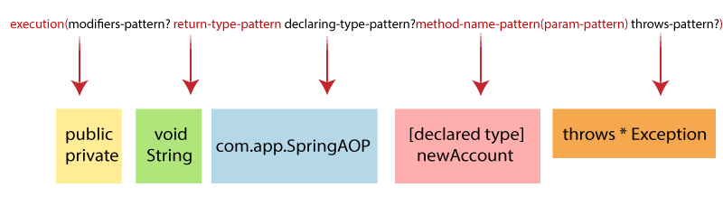
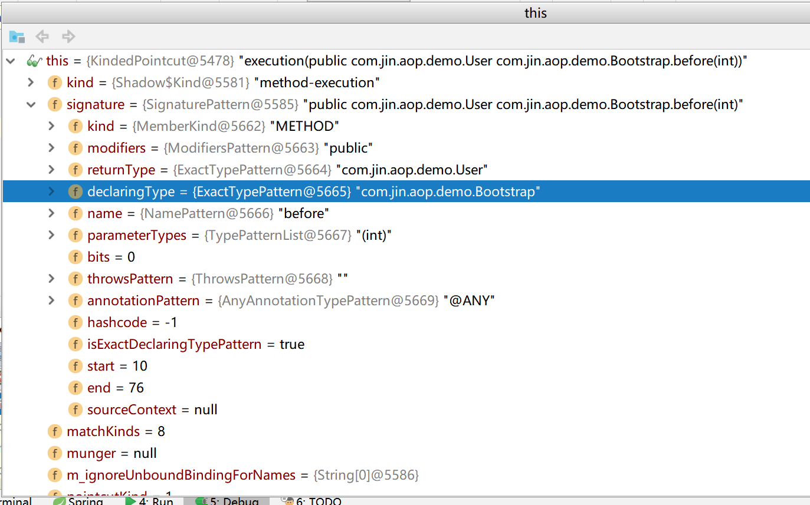
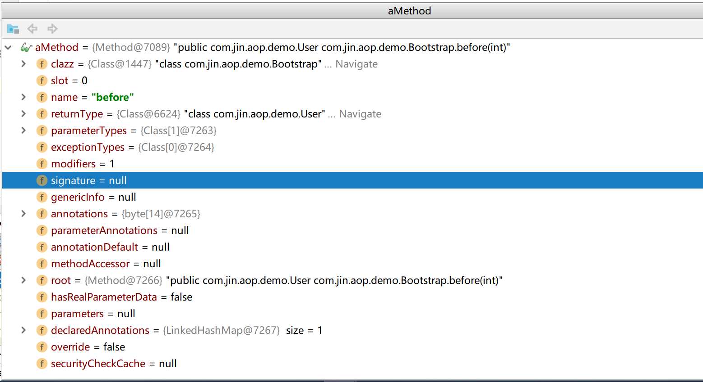

## 拦截器表达式








``` 
/**
     * execution:
     *
     *  "execution(public com.jin.gateway.downstream.bean.Student com.jin.gateway.downstream.Bootstrap.student(com.jin.gateway.downstream.bean.Student))"
     *
     *  org.aspectj.weaver.patterns.SignaturePattern
     *
     *  modifiers(方法修饰符): public
     *  returnType(方法返回类型): com.jin.gateway.downstream.bean.Student
     *  declaringType(方法完全限定名): com.jin.gateway.downstream.Bootstrap
     *  name(方法名): student
     *  parameterTypes(方法参数类型列表):com.jin.gateway.downstream.bean.Student
     *  throwsPattern(异常):
     *  annotationPattern(注解):
     *
     * execution(modifiers returnType declaringType.name(parameterTypes)throwsPattern)
     *
     * within:
     * within表达式的粒度为类，其参数为全路径的类名（可使用通配符）
     * within(declaring-type-pattern)
     *
     *
     * args:
     * args表达式的作用是匹配指定参数类型和指定参数数量的方法，无论其类路径或者是方法名是什么。这里需要注意的是，args指定的参数必须是全路径的。如下是args表达式的语法：
     * args(param-pattern)
     *
     * @annotation:
     * @annotation的使用方式与@within的相似，表示匹配使用@annotation指定注解标注的方法将会被环绕，其使用语法如下：

     @annotation(annotation-type)
     *
     *
     *
     *
     *
     */
```


